# Database Entity Relationship Diagram

```mermaid
erDiagram
    User ||--o{ Customer : "extends (TABLE_PER_CLASS)"
    User ||--o{ Notification : "receives"
    User {
        bigint id PK
        varchar code UK "USR-XXX"
        varchar firstName
        varchar lastName
        varchar email UK
        varchar password
        varchar mobile
        UserStatus status "ACTIVE/DISABLED"
        Set roles "ADMIN/OPERATOR/FINANCE/CUSTOMER"
        timestamp createdAt
    }

    Customer ||--o{ Meter : "owns"
    Customer ||--o{ Bill : "billed to"
    Customer {
        bigint id PK
        varchar code UK
        varchar firstName
        varchar lastName
        varchar email UK
        varchar password
        varchar mobile
        UserStatus status
        Set roles
        timestamp createdAt
        varchar nationalId UK "16 digits"
        varchar address
        CustomerStatus customerStatus "ACTIVE/INACTIVE"
        decimal surplus "overpayment balance"
        timestamp createdAt
        timestamp updatedAt
    }

    Meter ||--o{ MeterReading : "has readings"
    Meter ||--o{ Bill : "billed for"
    Meter {
        bigint id PK
        varchar meterNumber UK
        MeterType meterType "DOMESTIC/COMMERCIAL/INDUSTRIAL"
        date installationDate
        MeterStatus status "ACTIVE/INACTIVE/DECOMMISSIONED"
        bigint customerId FK
        timestamp createdAt
        timestamp updatedAt
    }

    MeterReading ||--o{ Bill : "generates bill"
    MeterReading {
        bigint id PK
        bigint meterId FK
        double previousReading
        double currentReading
        date readingDate
        varchar notes
        timestamp createdAt
        timestamp updatedAt
    }

    Tariff ||--o{ Bill : "applied to"
    Tariff {
        bigint id PK
        MeterType meterType
        decimal ratePerUnit
        decimal fixedServiceCharge
        decimal vatRate
        date effectiveDate
        date expiryDate
        TariffStatus status "ACTIVE/INACTIVE"
        timestamp createdAt
        timestamp updatedAt
    }

    Bill ||--o{ Payment : "receives payments"
    Bill ||--o{ Notification : "triggers notifications"
    Bill {
        bigint id PK
        bigint customerId FK
        bigint meterId FK
        bigint meterReadingId FK
        bigint tariffId FK
        integer billingMonth
        integer billingYear
        double previousReading
        double currentReading
        double consumption
        decimal consumptionCharge
        decimal fixedServiceCharge
        decimal vatAmount
        decimal penaltyAmount
        decimal totalAmount
        decimal amountPaid
        decimal outstandingBalance
        date dueDate
        BillStatus status "PENDING/APPROVED/PARTIALLY_PAID/PAID/OVERDUE/CANCELLED"
        timestamp createdAt
        timestamp updatedAt
    }

    Payment ||--o{ Notification : "triggers notifications"
    Payment {
        bigint id PK
        bigint billId FK
        varchar referenceNumber UK
        decimal amountPaid
        PaymentMethod paymentMethod "CASH/MOBILE_MONEY/BANK_TRANSFER/CHECK"
        varchar transactionId
        varchar notes
        date paymentDate
        timestamp createdAt
        timestamp updatedAt
    }

    Notification {
        bigint id PK
        bigint customerId FK
        NotificationType notificationType "BILL_GENERATED/PAYMENT_RECEIVED/PAYMENT_CONFIRMED/BILL_OVERDUE/ACCOUNT_UPDATE"
        varchar subject
        text message
        bigint relatedBillId FK
        bigint relatedPaymentId FK
        boolean read
        boolean emailSent
        timestamp emailSentAt
        timestamp createdAt
        timestamp updatedAt
    }
```

## Entity Descriptions

### User
Base entity for all users in the system. Contains common user information including authentication details and roles.

### Customer
Extends User entity with customer-specific information for utility billing. Includes national ID, address, customer status, and surplus balance for tracking overpayments.

### Meter
Physical meter installed at customer premises. Tracks consumption readings and is associated with a specific customer.

### MeterReading
Periodic readings taken from meters to calculate consumption. Used as basis for bill generation.

### Tariff
Pricing structure for different meter types. Includes rate per unit, fixed charges, and VAT rates with effective date ranges.

### Bill
Generated bill for a customer based on meter readings and applicable tariffs. Tracks consumption, charges, payments, and outstanding balance. Supports partial payments and surplus application.

### Payment
Payment transactions made against bills. Supports multiple payment methods and tracks payment history.

### Notification
System notifications sent to customers about bills, payments, and account updates. Includes email delivery tracking.
