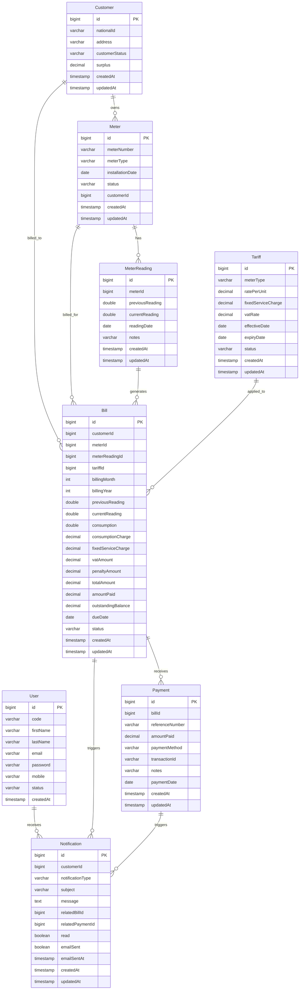

# Utility Billing System - Database ER Diagram

## Architecture Components

### Client Layer
- **Web Browser**: For web-based access to the utility billing system
- **Mobile App**: Native mobile application for customers
- **API Client**: Third-party integrations via REST API

### API Gateway / Security Layer
- **Spring Boot Application**: Main application entry point
- **JWT Authentication Filter**: Secures API endpoints using JWT tokens
- **Authentication Manager**: Handles user authentication and authorization

### Controller Layer
REST API controllers that handle HTTP requests and responses:
- **AuthController**: User registration, login, token refresh
- **CustomerController**: Customer CRUD operations and search
- **BillController**: Bill generation, approval, and retrieval
- **PaymentController**: Payment processing and history
- **MeterController**: Meter installation and readings
- **TariffController**: Tariff management
- **NotificationController**: Notification retrieval and management

### Service Layer
Business logic implementation:
- **AuthService**: User authentication and JWT token management
- **CustomerService**: Customer management with inheritance support
- **BillingService**: Bill generation with surplus application and partial payment support
- **PaymentService**: Payment processing with surplus tracking and partial payment handling
- **MeterService**: Meter and meter reading management
- **TariffService**: Tariff management with date-based versioning
- **NotificationService**: Notification creation and email delivery
- **EmailService**: Email sending via SMTP

### Repository Layer
Spring Data JPA repositories for data access:
- **UserRepository**: User entity CRUD operations
- **CustomerRepository**: Customer entity with search capabilities
- **BillRepository**: Bill entity with filtering and search
- **PaymentRepository**: Payment entity with reference tracking
- **MeterRepository**: Meter entity management
- **MeterReadingRepository**: Meter reading history
- **TariffRepository**: Tariff with date-based queries
- **NotificationRepository**: Notification management

### Data Layer
- **PostgreSQL Database**: Relational database for persistent storage
- **Flyway**: Database schema version control and migration

### External Services
- **SMTP Server (Gmail)**: Email delivery for notifications

## Key Features

### Security
- JWT-based authentication
- Role-based access control (ADMIN, OPERATOR, FINANCE, CUSTOMER)
- Customer-specific data access control

### Billing & Payments
- Automatic bill generation from meter readings
- Surplus balance tracking for overpayments
- Partial payment support with outstanding balance tracking
- Automatic surplus application to future bills

### Notifications
- Email notifications for bills, payments, and reminders
- Partial payment reminders with remaining balance
- Full payment confirmations

### Data Management
- JPA inheritance (Customer extends User)
- TABLE_PER_CLASS inheritance strategy
- Flyway database migrations
- BigDecimal for monetary calculations
